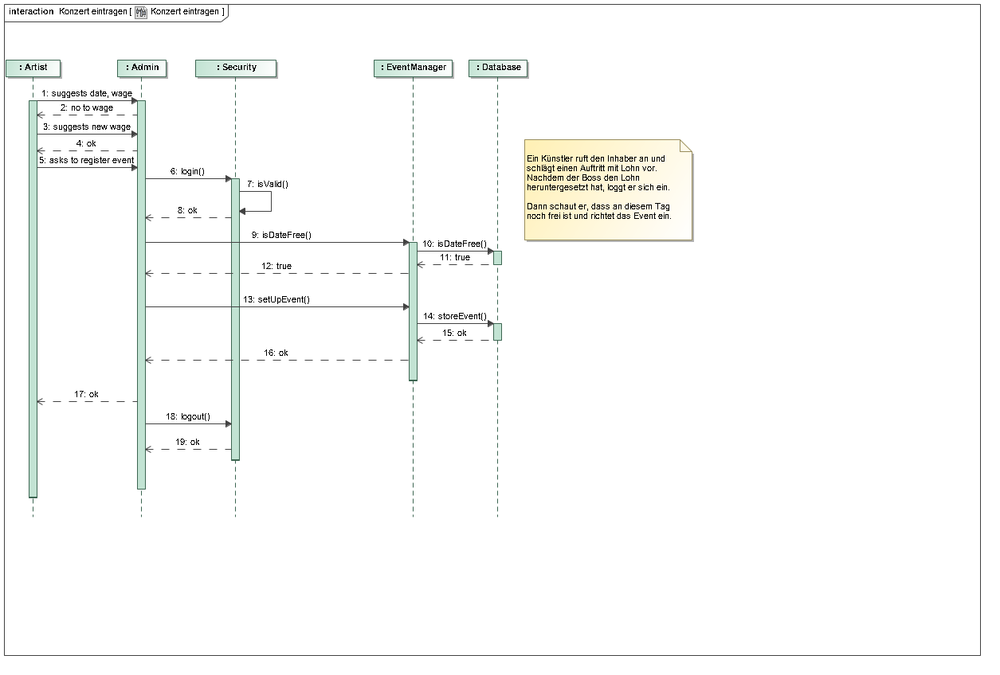
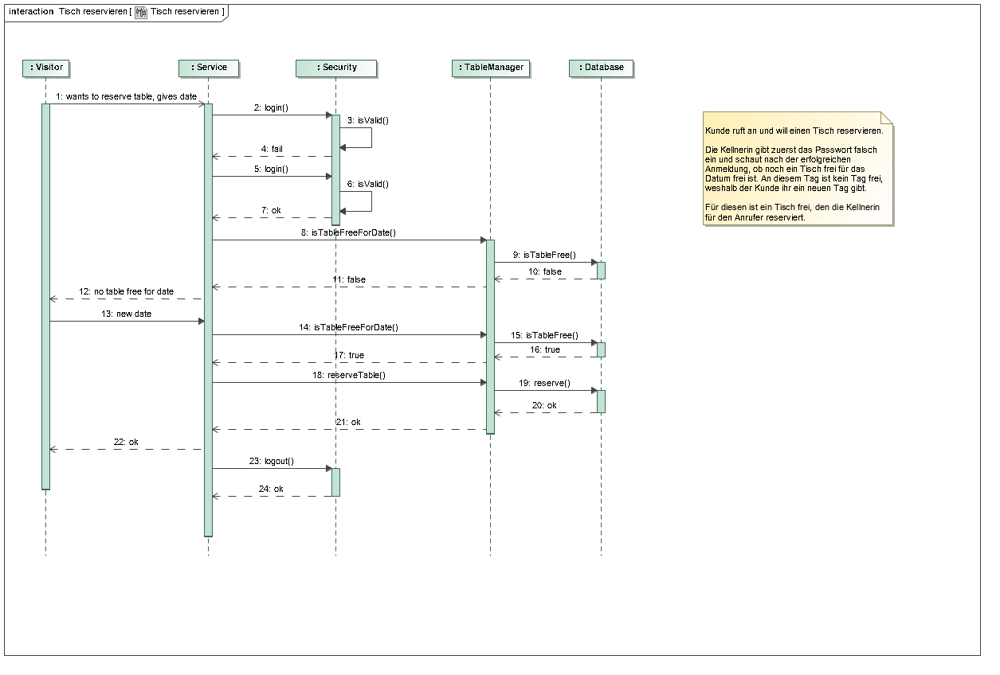
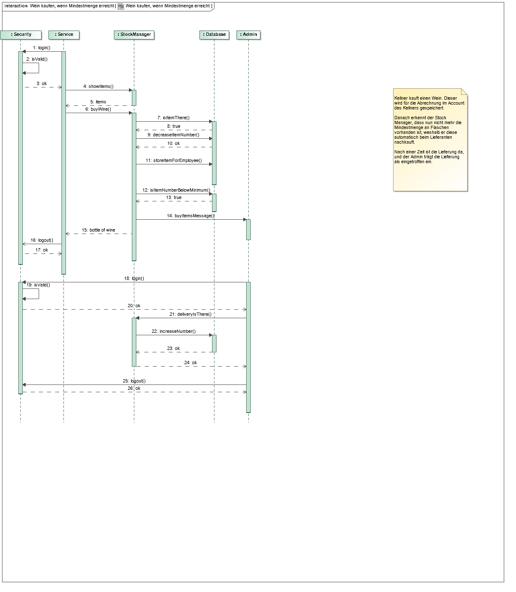
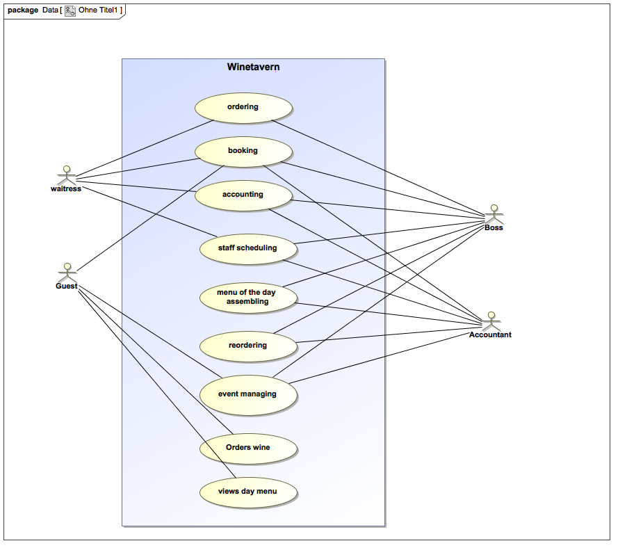
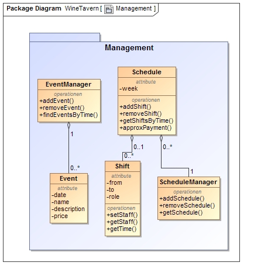
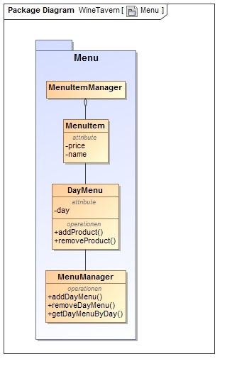
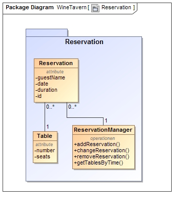
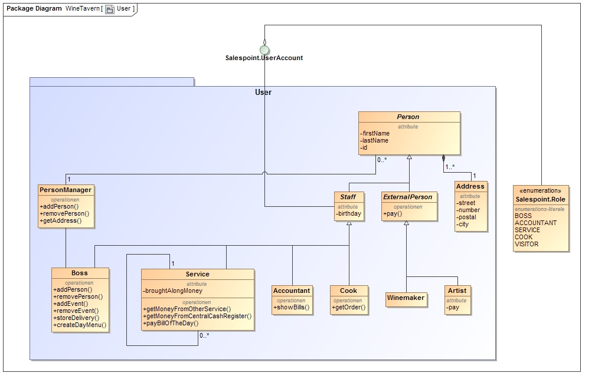

= Pflichtenheft

== Projektname

__Version:__    *2.0*

__Status:__     *In Arbeit*

__Stand:__      *10.01.2017*

== Zusammenfassung
Eine kurze Beschreibung des Dokuments. Wenige Absätze.

== Inhaltsverzeichnis
<<aufgabenstellung-und-zielsetzung>> +
<<fachlicher-Überblick>> +
<<systemgrenze-und-top-level-architektur>> +
<<anwendungsfälle>> +
<<anforderungen>> +
<<gui-prototyp>> +
<<datenmodell>> +
<<akzeptanztestfälle>> +
<<offene-punkte>> +

== Aufgabenstellung und Zielsetzung
.Das vorliegende Projekt umfasst die Erstellung eines Salespoints mit folgenden Funktionen:
* Erstellung eines Kassensystems
* Zusammenstellen einer Tageskarte
* Nachbestellungen bei Lieferanten und Abrechnung
* Veranstaltungsprogramm und Abrechnung mit Künstlern
* täglich Abrechnung des Betriebsergebnisses
* Personalverwaltung

== Fachlicher Überblick
Einleitung für fachfremde Personen

== Systemgrenze und Top-Level-Architektur

=== Kontextdiagramm
image::src/Kontextdiagramm.jpg[Kontextdiagramm, 362, 170, link=src/Kontextdiagramm.jpg]

=== Top-Level Architektur
image::src/Top-Level-Architecture.png[Top-Level-Architektur, 763, 469, link=src/Top-Level-Architecture.png]

=== Sequenzdiagramme

image::src/Sequenzdiagramme/Tagesrechnung.png[Sequenzdiagramm 1, 600,400 link=src/Sequenzdiagramme/Tagesrechnung.png]

== Anwendungsfälle

=== Überblick Anwendungsfalldiagramm
//Anwendungsfall-Diagramm, das alle Anwendungsfälle und alle Akteure darstellt

=== Akteure und Anwendungsfallbeschreibung

[options="header"]
|===
|Name       |Beschreibung
|Boss/Admin |Hat Rechte um auf alle Funktionen des Systems zuzugreifen
|Accountant |Bürokraft, zuständig für Personal und Rechnungswesen
|Service    |Vermittler/in zwischen Gast und Kassensystem
|Cook       |Angestellter in der Küche. Erhält Sicht auf offene Bestellungen
|Visitor    |Externer Besucher der Website. Nur öffentliche Sicht auf das System
|===

== Anforderungen

=== Muss-Kriterien
* Personalverwaltung
* Kassensystem
    ** Korrekte Berechnung der Preise: Bedienstete zahlen 90% des Kartenpreises
    ** Erstellung von Rechnungen mit der Option diese zu teilen
    ** Nachbestellungen auf vorhandene Rechnung möglich
    ** Aufnahme von Bestellungen pro Tisch (identifiziert durch eine Nummer)
    ** Tägliche Abrechnung des Betriebsereignisses
        *** Personengebungene Abrechnung
        *** Nicht bezahlte Waren werden von der Bedienung getragen
    ** Abrechnung mit Künstlern
* Weiterleitung der Bestellungen an die Küche
* Zusammenstellen einer Tageskarte (durch modifizieren der Karte des vergangenen Tages)
* Events verwalten
    ** Weinproben
        *** Ausschließlicher Ausschank von Weinen des Winzers, diese Weine kosten 50% des Normalpreise
    ** Kleinkunstveranstaltungen

=== Kann-Kriterien
//Anforderungen die das Programm leisten können soll, aber für den korrekten Betrieb entbehrlich sind.
* Graphische Verwaltung der Tische
* Graphische Verwaltung der Tischreservierungen
* Automatische Nachbestellung von Waren

== GUI Prototyp

=== Überblick: Dialoglandkarte
//Erstellen Sie ein Übersichtsdiagramm, das das Zusammenspiel Ihrer Masken zur Laufzeit darstellt. Also mit welchen Aktionen zwischen den Masken navigiert wird. Die nachfolgende Abbildung zeigt eine an die Pinnwand gezeichnete Dialoglandkarte. Ihre Karte sollte zusätzlich die Buttons/Funktionen darstellen, mit deren Hilfe Sie zwischen den Masken navigieren.

image::src/Dialoglandkarte.png[Dialoglandkarte, 600, link=src/Doaloglandkarte.png]

=== Dialogbeschreibung

==== 1.1 Frontend:

	Seite unterteilt sich in einzelne Sections, um die Seite besser zu strukturieren

* beim Öffnen der Seite wird ein **Slider** angezeigt, dieser vermittelt einen genauen Eindruck der Weinstube.

* im Kopf werden einzelne Reiter verlinkt die als **Navigation** dienen

* unterhalb des Sliders wird ein **Willkommenstext** stehen

* anschließend folgt eine Auflistung von anstehenden **Events**/News

* im folgenden Abschnitt wird auf die **Speisekarte** verlinkt:

    ** *Button*: auf "Speisekarte öffnen": Aus der Section schiebt sich eine Seite ein, auf dieser können alle
    Speisen betrachtet werden

* eine **Anfahrtsbeschreibung** (GoogleMaps?)

* im letzten Abschnitt werden **Kontakt** und **Impressum** dargestellt und ein **Kontaktformular** angezeigt

==== 1.2 Backend:

* um in das Backend zu gelangen, nutzt man ein **Login**-Formular mit Abfrage in Form von:

    ** username
    ** password
* bei erfolgreichem Login wird man zum **Dashbord** weiterführt
    ** Überblick/ letzten Aktivitäten
    ** Wochenübersicht
    ** Kalender
* die Seitennavigation teilt das System in einzelne Abschnitte die im Folgenden weiter beschrieben werden:

* im Menüpunkt **Karte** können Veränderungen in der Speisekarte vorgenommen werden, dies erfolgt durch:
    ** *Button*: hinzufügen oder
    ** *Button*: entfernen eines Produktes

* Anpassung der **Tageskarte** nach Übernahme der Vorherigen

* unter **Reservierungen** werden dem Nutzer Funktionen aufgelistet:

    ** verfügbare Tische
    ** *Button*: hinzufügen einer neuen Reservierung in Form eines Formulars
    ** *Button*: löschen
    ** *Button*: Details der Reservierung bearbeiten
* die **Abrechnungsfunktion **ermöglicht:

    ** *Button*: neue Rechnung erstellen
    ** *Button*: Rechnung aufzuteilen
    ** *Button*: abschließen/bezahlt markieren
* im Abschnitt **Lagerverwaltung**, unterteilt in separate Kategorien, Produkt
    ** notwendige Nachbestellungen
    ** *Button*: Produkt hinzufügen
    ** *Button*: Produkt bearbeiten/Details
* **Event** eine Übersicht der anstehenden Events

    ** *Button*: hinzufügen eines neuen Events in einem Formular
    ** *Button*: löschen der Veranstaltung
    ** *Button*: Event bearbeiten
* der Abschnitt **Management** wird in zwei Bereiche unterteilt:
    ** **Zeitpläne**: Verwaltung der Arbeitszeiten
        *** *Button*: hinzufügen
        *** *Button*: bearbeiten
    ** **Mitarbeiter**: Verwaltung der Benutzerkonten
        *** *Button*: hinzufügen
        *** *Button*: bearbeiten
        *** *Button*: löschen

Für jeden Dialog:

1. Kurze textuelle Dialogbeschreibung eingefügt: Was soll der jeweilige Dialog? Was kann man damit tun? Überblick?
2. Maskenentwürfe (Screenshot, Mockup)
3. Maskenelemente (Ein/Ausgabefelder, Aktionen wie Buttons, Listen, …)
4. Evtl. Maskendetails, spezielle Widgets

== Datenmodell

=== Überblick: Klassendiagramm
image::src/Klassendiagramm/Accountancy.jpg[Package Accountancy, 500, link=src/Klassendiagramm/Accountancy.jpg]

image::src/Klassendiagramm/Stock.jpg[Package Stock, 500, link=src/Klassendiagramm/Stock.jpg]

Alle Paket-externen Beziehungen sind in den Paketdiagrammen nicht dargestellt, aber im
link:src/Klassendiagramm/Klassendiagramm3.jpg[kompletten Klassendiagramm] einsehbar.

=== Klassen und Enumerationen

// See http://asciidoctor.org/docs/user-manual/#tables
[options="header"]
|===
|Klasse/Enumeration |Beschreibung
|*manager |Controller Klassen welche alle Anfragen behandeln und die Anzeige vorbereiten
|Bill* |Rechnung, welche Service und Tisch spezifisch, alle Bestellungen sammelt
|Expense* |Alle weiteren Ausgaben, bezüglich Events, Nachbestellungen ...
|DayMenu |Tagespezifische Karte
|Product |Produkt im Lager
|ProductCategory |Produktkategorien und Oberkategorien
|Order |nötige Nachbestellungen
|Shift |personenbezogene Arbeitsschicht
|Schedule |Wochenarbeitsplan
|Person |Oberklasse für alle Personen, mit Adresse
|ExternalPerson |Externe Personen unterteilt in Winzer und Künstler
|Staff |Mitarbeiter, unterteilt in Chef,Servicekraft,Bürokraft,Koch
|Reservation |Tisch- und gastspezifische Reservierung
|Table |Tisch
|===

== Akzeptanztestfälle
[options="header"]
|======================
|ID |Test
|1  |Ein Besucher der Website kann die Homepage aufrufen. Er kann die Termine der nächsten Events sehen, ohne sich einloggen zu müssen.
|2  |Ein Buchhalter lässt sich nach dem Login alle ausgestellten Rechnungen anzeigen. Dazu wurden vorher alle Rechnungen gespeichert.
|3  |Der Boss loggt sich ein. Daraufhin entlässt er 2 Kellner und fügt einen neuen hinzu.
|4  |Der Boss kann nach einem Gespräch mit einem Künstler oder einem Winzer ein Event festlegen. Bei einem Künstler wird zusätzlich die feste Gage festgelegt, während bei einem Winzerabend der Wein billiger verkauft wird.
|5  |Der Admin kann die Tageskarte erstellen. Dabei kann er den vorherigen Tag als Vorlage nehmen und zusätzliche Gegenstände aus dem Lager zur Tageskarte hinzufügen und andere Gegenstände von der Karte entfernen.
|6  |Wenn ein Gast die Weinstube anruft, kann der Kellner einen Tisch für ihn reservieren. Hierbei loggt sich der Kellner zuerst in das System ein, um dann den Tisch für den Gast zu reservieren.
|7  |Nachdem die Kellnerin eine Bestellung aufgenommen hat, kann sie die entsprechenden Speisen und Getränke kaufen. Dafür muss sie sich einloggen, um danach die entsprechenden Gegenstände zu kaufen. Dies wird auf die Endabrechnung der Kellnerin geschrieben.
|8  |Nachdem ein Teil der Personen an Tisch 17 die Rechnung bezahlen wollen, um dann zu gehen, hat die Kellnerin die Rechnung gesplitet. Der Rest des Tisches kauft sich danach noch jeweils einen Wein. Nach einiger Zeit bezahlt ein Mann die Rechnung für den restlichen Tisch.
|9  |Als nach einer Bestellung die Menge von Brot im Lager die Mindestmenge unterschreitet, wird dies vom System erkannt. Das System kennzeichnet kritische Lagerstände. Nachdem der Admin die Lieferung erhalten hat, kann er die Brotbestände im Lager anpassen.
|======================

== Offene Punkte
Offene Punkte werden entweder direkt in der Spezifikation notiert. Wenn das Pflichtenheft  zum finalen Review vorgelegt wird, sollte es keine offenen Punkte mehr geben.
