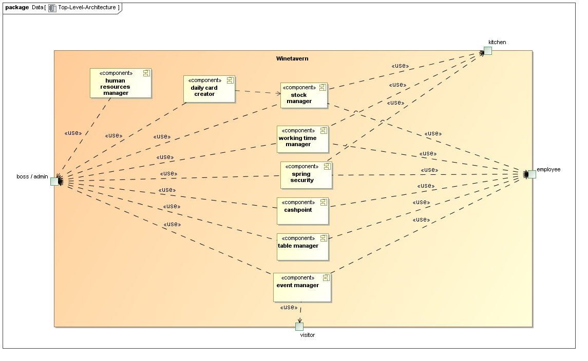
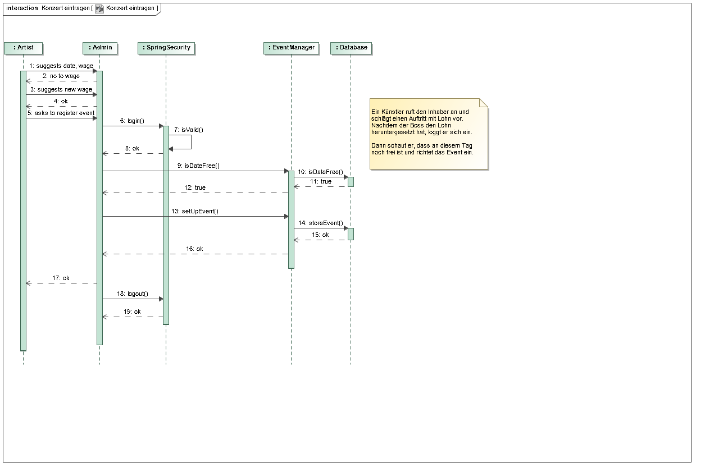
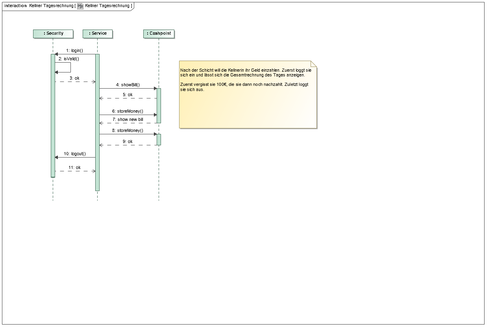
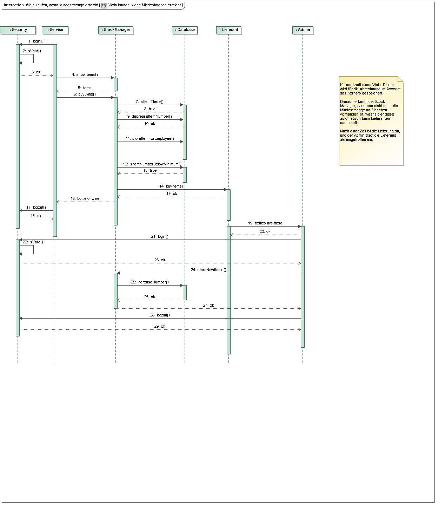
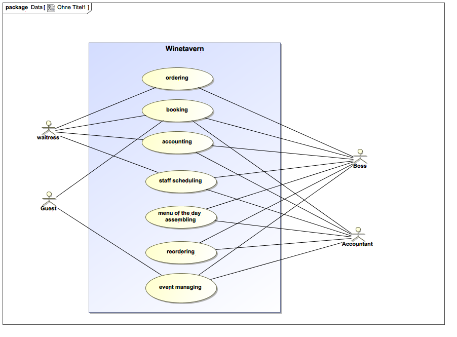

= Pflichtenheft

== Projektname

__Version:__    *1.0*

__Status:__     *In Arbeit*

__Stand:__      *26.10.2016*

== Zusammenfassung
Eine kurze Beschreibung des Dokuments. Wenige Absätze.

== Inhaltsverzeichnis
<<aufgabenstellung-und-zielsetzung>>
<<fachlicher-Überblick>>
<<systemgrenze-und-top-level-architektur>>
<<anwendungsfälle>>
<<anforderungen>>
<<gui-prototyp>>
<<datenmodell>>
<<aktzeptanztestfälle>>
<<offene-punkte>>

== Aufgabenstellung und Zielsetzung
.Das vorliegende Projekt umfasst die Erstellung eines Salespoints mit folgenden Funktionen:
* Erstellung eines Kassensystems
* Zusammenstellen einer Tageskarte
* Nachbestellungen bei Lieferanten und Abrechnung
* Veranstaltungsprogramm und Abrechnung mit Künstlern
* täglich Abrechnung des Betriebsergebnisses
* Personalverwaltung

== Fachlicher Überblick
Einleitung für fachfremde Personen

== Systemgrenze und Top-Level-Architektur

=== Kontextdiagramm
image::src/Kontextdiagramm.jpg[Kontextdiagramm, 362, 170, link=src/Kontextdiagramm.jpg]

=== Top-Level Architektur

=== Sequenzdiagramme

image::src/Sequenzdiagramme/Tischreservierung.png[Sequenzdiagramm 1, 600,400 link=src/Sequenzdiagramme/Tischreservierung.png]

== Anwendungsfälle

=== Überblick Anwendungsfalldiagramm
Anwendungsfall-Diagramm, das alle Anwendungsfälle und alle Akteure darstellt

=== Akteure

Akteure sind die Benutzer des Software-Systems oder Nachbarsysteme, welche darauf zugreifen. Dokumentieren Sie die Akteure in einer Tabelle. Diese Tabelle gibt einen Überblick über die Akteure und beschreibt sie kurz. Die Tabelle hat also mindestens zwei Spalten (Akteur Name und Kommentar).

// See http://asciidoctor.org/docs/user-manual/#tables
[options="header"]
|===
|Name       |Beschreibung
|Boss/Admin |Hat Rechte um auf alle Funktionen des Systems zuzugreifen
|Accountant |Bürokraft, zuständig für Personal und Rechnungswesen
|Service    |Vermittler/in zwischen Gast und Kassensystem
|Cook       |Angestellter in der Küche. Erhält Sicht auf offene Bestellungen
|Visitor    |Externer Besucher der Website. Nur öffentliche Sicht auf das System
|===

=== Anwendungsfallbeschreibungen
Dieser Unterabschnitt beschreibt die Anwendungsfälle. In dieser Beschreibung müssen noch nicht alle Sonderfälle und Varianten berücksichtigt werden. Schwerpunkt ist es, die wichtigsten Anwendungsfälle des Systems zu finden. Wichtig sind solche Anwendungsfälle, die für den Auftraggeber, den Nutzer den größten Nutzen bringen.
Für komplexere Anwendungsfälle ein UML-Sequenzdiagramm ergänzen.
Einfache Anwendungsfälle mit einem Absatz beschreiben.
Die typischen Anwendungsfälle (Anlegen, Ändern, Löschen) können zu einem einzigen zusammengefasst werden.

== Anforderungen

=== Muss-Kriterien
Was das zu erstellende Programm auf alle Fälle leisten muss.

=== Kann-Kriterien
Anforderungen die das Programm leisten können soll, aber für den korrekten Betrieb entbehrlich sind.

== GUI Prototyp

=== Überblick: Dialoglandkarte
Erstellen Sie ein Übersichtsdiagramm, das das Zusammenspiel Ihrer Masken zur Laufzeit darstellt. Also mit welchen Aktionen zwischen den Masken navigiert wird. Die nachfolgende Abbildung zeigt eine an die Pinnwand gezeichnete Dialoglandkarte. Ihre Karte sollte zusätzlich die Buttons/Funktionen darstellen, mit deren Hilfe Sie zwischen den Masken navigieren.

=== Dialogbeschreibung
Für jeden Dialog:

1. Kurze textuelle Dialogbeschreibung eingefügt: Was soll der jeweilige Dialog? Was kann man damit tun? Überblick?
2. Maskenentwürfe (Screenshot, Mockup)
3. Maskenelemente (Ein/Ausgabefelder, Aktionen wie Buttons, Listen, …)
4. Evtl. Maskendetails, spezielle Widgets

== Datenmodell

=== Überblick: Klassendiagramm
UML-Analyseklassendiagramm

=== Klassen und Enumerationen

// See http://asciidoctor.org/docs/user-manual/#tables
[options="header"]
|===
|Klasse/Enumeration |Beschreibung
|Event|Sammelt alle Informationen zu den Veranstaltungen.
|Person|Sammelt alle Informationen für jede angestellte Person, samt Login.
|Produkt|Sammelt alle Informationen über ein Produkt(bspw. Name, Kategorie, Menge, ...)
|Rechnung|Sammlung für alle gekauften Produkte pro Tisch und Bedienung samt Stückzahl.
|Rolle (Enumeration)|Rechtemanagement für Personal
|Termin|Zeitspanne, mit Datum, Anfangs- und Endzeit
|Tisch|...
|===

== Aktzeptanztestfälle
Mithilfe von Akzeptanztests wird geprüft, ob die Software die funktionalen Erwartungen und Anforderungen im Gebrauch erfüllt. Diese sollen und können aus den Anwendungsfallbeschreibungen und den UML-Sequenzdiagrammen abgeleitet werden. D.h., pro (komplexen) Anwendungsfall gibt es typischerweise mindestens ein Sequenzdiagramm (welches ein Szenarium beschreibt). Für jedes Szenarium sollte es einen Akzeptanztestfall geben. Listen Sie alle Akzeptanztestfälle in tabellarischer Form auf.
Jeder Testfall soll mit einer ID versehen werde, um später zwischen den Dokumenten (z.B. im Test-Plan) referenzieren zu können.

== Offene Punkte
Offene Punkte werden entweder direkt in der Spezifikation notiert. Wenn das Pflichtenheft  zum finalen Review vorgelegt wird, sollte es keine offenen Punkte mehr geben.
